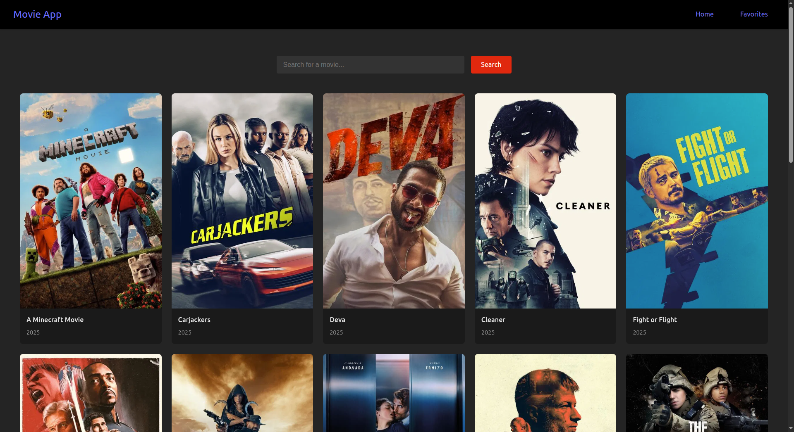
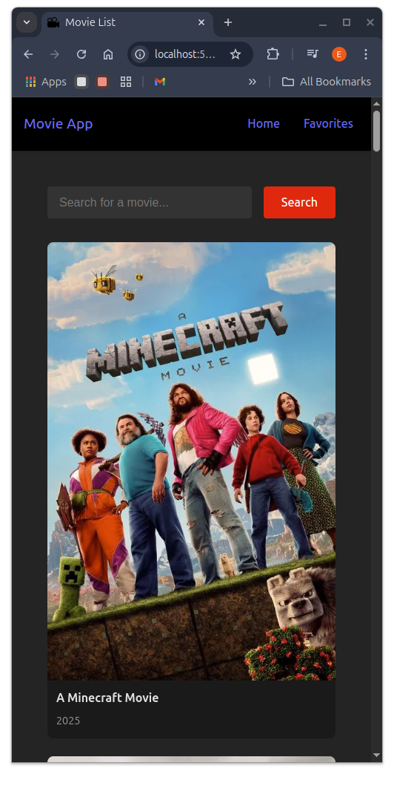
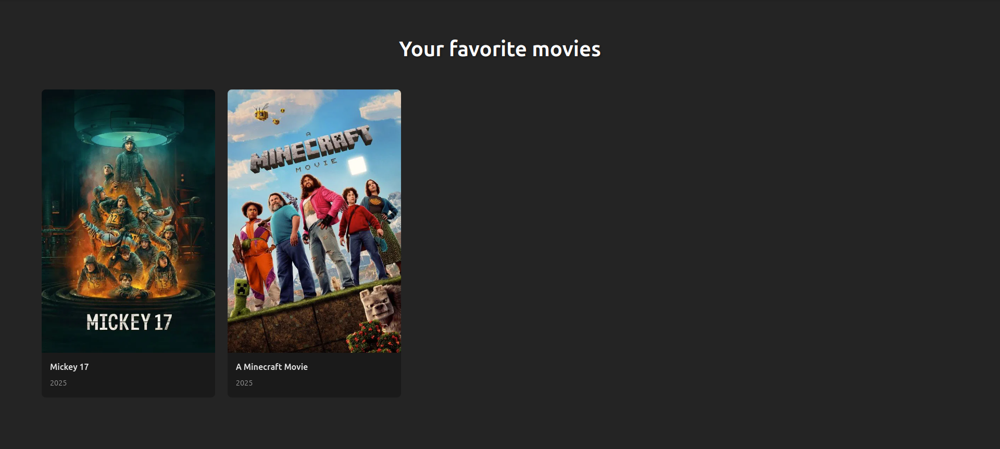
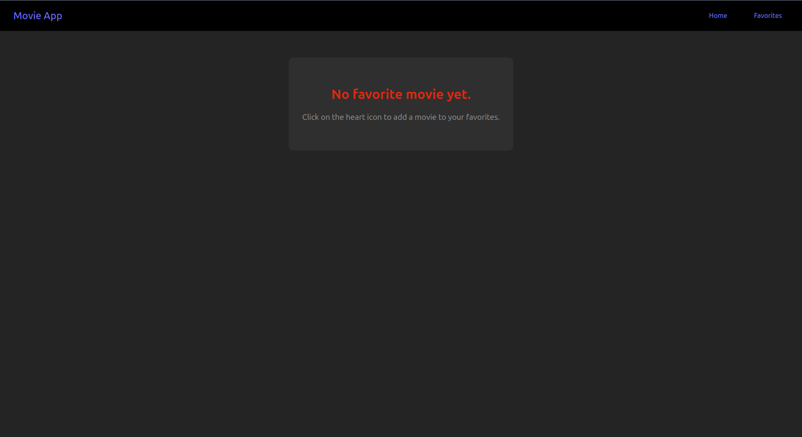

# 🎬 Simple React Movie App

A simple movie search app built with **React**. It allows users to search for movies, view results, and add them to a list of favorites. The UI is responsive and adapts well to different screen sizes, including phones.

---

## 🔥 Features

- 🔍 Search for movies using the OMDb API  
- ❤️ Add or remove favorite movies  
- 📱 Fully responsive layout  
- 🌙 Clean, dark-themed UI  

---

## 📸 Screenshots

### 🏠 Home Page  


### 📱 Responsive (Mobile View)  


### ❤️ Favorites Page  


### ⚠️ No Favorites Added  


---

## 🚀 Getting Started

1. Clone the repo:
    ```bash
    git clone https://github.com/your-username/react-movie-app.git
    ```

2. Install dependencies:
    ```bash
    npm install
    ```

3. Start the development server:
    ```bash
    npm run dev
    ```

---

## 🛠️ Built With

- [React](https://reactjs.org/)  
- [Vite](https://vitejs.dev/)  
- [OMDb API](http://www.omdbapi.com/)  

---

## 📄 License

This project is open-source and available under the MIT License.

---

## 🙌 Acknowledgements

- Movie data powered by [OMDb API](http://www.omdbapi.com/)
